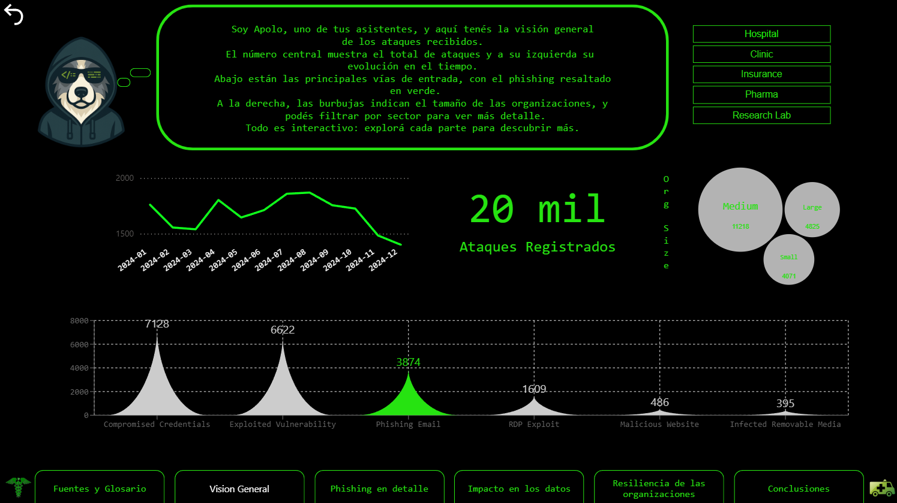
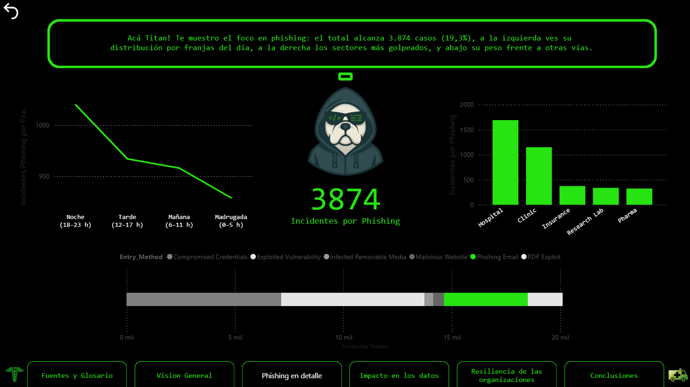
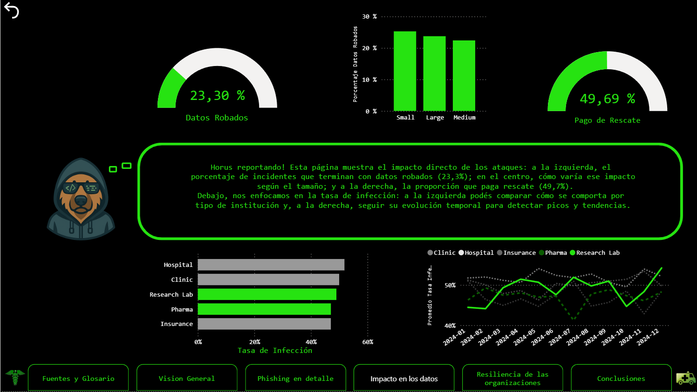
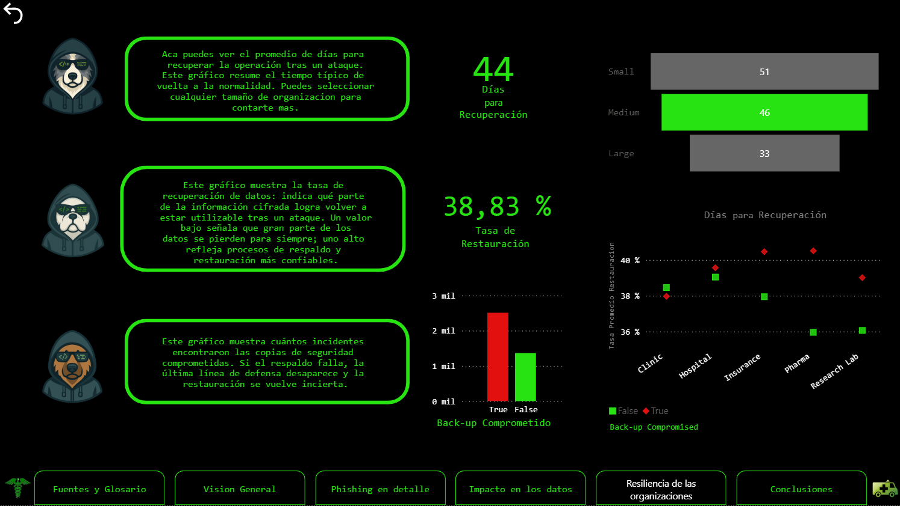

# Healthcare Ransomware Analytics



## Español

### Descripción del proyecto

El ransomware puede paralizar operaciones, comprometer respaldos y dejar expuesta información especialmente sensible. Este trabajo examina ese impacto dentro del sector salud y presta especial atención al phishing, el robo de datos, el pago de rescates y la capacidad de recuperación de las organizaciones.

Se trabajó con 5.000 registros correspondientes a 2024. Como cada fila puede reunir más de un ataque, el volumen analizado alcanza los 20.114 incidentes.

El análisis se concentró en cuatro preguntas:

- ¿Cuáles fueron los métodos de entrada más frecuentes?
- ¿Qué peso tuvo el phishing dentro y fuera del horario laboral?
- ¿Qué relación mostró con el robo de datos y el pago de rescates?
- ¿Qué capacidad de recuperación mostraron las organizaciones después de un ataque?

### Hallazgos principales

- Las credenciales comprometidas (35,4 %) y la explotación de vulnerabilidades (33,2 %) fueron los dos métodos de entrada más frecuentes. El correo de phishing ocupó el tercer lugar con un 18,9 %.
- Durante el horario laboral, el phishing representó el 19,9 % de los incidentes, frente al 18,8 % fuera del horario laboral.
- Entre los incidentes de phishing, hubo robo de datos en el 24,6 % de los casos ocurridos en horario laboral y en el 25,3 % de los ocurridos fuera de ese horario.
- El pago de rescates fue más frecuente en los incidentes de phishing ocurridos durante el horario laboral: 52,5 %, frente al 46,0 % fuera del horario laboral.
- En el conjunto completo, el tiempo medio de recuperación fue de 44 días, los respaldos resultaron comprometidos en el 64 % de los incidentes y las organizaciones restauraron aproximadamente el 43 % de los datos cifrados.

### Panel

| Visión general | Análisis de phishing |
| --- | --- |
|  |  |

| Impacto en los datos | Resiliencia organizacional |
| --- | --- |
|  |  |

Las demás páginas del panel están disponibles en la carpeta `images`.

### Metodología

1. Se revisó y limpió el conjunto de datos en Excel.
2. Los campos categóricos se normalizaron mediante tablas de referencia.
3. Se construyó un modelo relacional y una tabla de calendario.
4. Las transformaciones necesarias se realizaron con Power Query.
5. Se crearon medidas DAX para analizar incidentes, phishing, robo de datos, pago de rescates, tiempos de recuperación, restauración y respaldos comprometidos.
6. Los resultados se organizaron en un panel de Power BI con navegación, filtros, explicaciones y conclusiones.

### Herramientas

- Microsoft Excel
- SQL Server
- Power Query
- Power BI
- DAX

### Contenido del repositorio

```text
.
├── dashboard/
│   └── healthcare-ransomware-dashboard.pbix
├── data/
│   └── Healthcare_Ransomware_Analytics_Data.xlsx
├── docs/
│   └── healthcare-ransomware-analysis-report.pdf
├── images/
│   ├── 01-cover.png
│   ├── 02-sources-and-glossary.png
│   ├── 03-overview.png
│   ├── 04-phishing-detail.png
│   ├── 05-data-impact.png
│   ├── 06-organizational-resilience.png
│   └── 07-conclusions.png
└── README.md
```

### Abrir el proyecto

- El informe completo se encuentra en `docs/healthcare-ransomware-analysis-report.pdf`.
- El panel interactivo puede abrirse con Power BI Desktop desde `dashboard/healthcare-ransomware-dashboard.pbix`.
- El archivo preparado se encuentra en la carpeta `data`.

El archivo de Power BI utiliza datos importados, por lo que el panel guardado puede visualizarse sin actualizar el origen. Para actualizarlo en otra computadora, se debe modificar la ruta del archivo de Excel en la configuración del origen de datos de Power BI.

### Fuente y licencia de los datos

Los datos originales provienen del Healthcare Ransomware Dataset de Rivalytics, publicado en Kaggle bajo la licencia Creative Commons Attribution-ShareAlike 4.0. La dirección original también está documentada en el informe del proyecto.

Este repositorio contiene una versión transformada del conjunto de datos con fines educativos y de portafolio. La atribución y la licencia original deben conservarse al redistribuir los datos.

---

## English

### Project overview

Ransomware can disrupt critical operations, compromise backups, and expose highly sensitive information. This project examines that impact across the healthcare sector, with particular attention to phishing, data theft, ransom payments, and the ability of affected organizations to recover.

The analysis uses 5,000 records from 2024. Since each row may represent more than one attack, the data accounts for 20,114 incidents in total.

The work focused on four questions:

- Which entry methods appeared most often?
- How did the share of phishing change during and outside working hours?
- What relationship did phishing show with data theft and ransom payments?
- How well did organizations recover after an attack?

### Key findings

- Compromised credentials (35.4%) and exploited vulnerabilities (33.2%) were the two most common entry methods. Phishing email ranked third at 18.9%.
- During working hours, phishing represented 19.9% of incidents, compared with 18.8% outside working hours.
- Among phishing incidents, data theft occurred in 24.6% of working-hours cases and 25.3% of cases outside working hours.
- Ransom payments were more frequent for working-hours phishing incidents: 52.5% compared with 46.0% outside working hours.
- Across the full dataset, average recovery time was 44 days, backups were compromised in 64% of incidents, and organizations restored approximately 43% of encrypted data.

### Dashboard

| Overview | Phishing analysis |
| --- | --- |
|  |  |

| Data impact | Organizational resilience |
| --- | --- |
|  |  |

Additional dashboard pages are available in the `images` folder.

### Methodology

1. The source data was reviewed and cleaned in Excel.
2. Categorical fields were normalized into reference tables.
3. A relational model and calendar table were created.
4. The required transformations were completed in Power Query.
5. DAX measures were built for incidents, phishing, data theft, ransom payments, recovery time, restoration, and compromised backups.
6. The results were organized in a Power BI dashboard with navigation, filters, explanations, and conclusions.

### Tools

- Microsoft Excel
- SQL Server
- Power Query
- Power BI
- DAX

### Repository contents

```text
.
├── dashboard/
│   └── healthcare-ransomware-dashboard.pbix
├── data/
│   └── Healthcare_Ransomware_Analytics_Data.xlsx
├── docs/
│   └── healthcare-ransomware-analysis-report.pdf
├── images/
│   ├── 01-cover.png
│   ├── 02-sources-and-glossary.png
│   ├── 03-overview.png
│   ├── 04-phishing-detail.png
│   ├── 05-data-impact.png
│   ├── 06-organizational-resilience.png
│   └── 07-conclusions.png
└── README.md
```

### Open the project

- The complete report is available at `docs/healthcare-ransomware-analysis-report.pdf`.
- The interactive dashboard can be opened with Power BI Desktop from `dashboard/healthcare-ransomware-dashboard.pbix`.
- The prepared workbook is stored in the `data` folder.

The Power BI file uses imported data, so the saved dashboard can be viewed without refreshing the source. To refresh it on another computer, update the workbook path in Power BI's data source settings.

### Data source and license

The source data is the Healthcare Ransomware Dataset by Rivalytics, published on Kaggle under the Creative Commons Attribution-ShareAlike 4.0 license. The original address is also documented in the project report.

This repository contains a transformed version of the dataset for educational and portfolio purposes. Dataset attribution and the original license must be preserved when redistributing the data.
